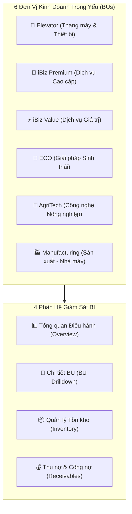
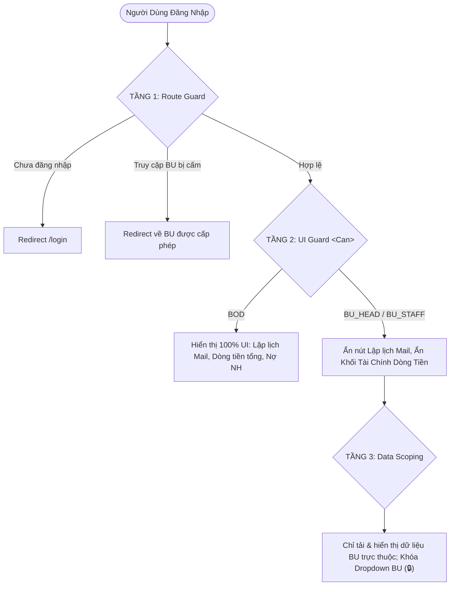

# SYSTEM ARCHITECTURE & OPERATIONS MANUAL
## BÁO CÁO KIẾN TRÚC HỆ THỐNG & CẨM NANG VẬN HÀNH DỰ ÁN
**Hệ thống:** Executive BI & Operations Report System (`project-dashboard`)  
**Phiên bản:** v0.4.7 (Production Ready)  
**Ngày phát hành:** 17/08/2026  
**Công nghệ nền tảng:** React 19 + Vite 8 + React Router v7 + Recharts

---

## MỤC LỤC
1. [🎯 Tổng Quan Nghiệp Vụ & Phạm Vi Hệ Thống](#1--tổng-quan-nghiệp-vụ--phạm-vi-hệ-thống)
2. [🛠️ Tech Stack & Danh Mục Dependencies](#2-️-tech-stack--danh-mục-dependencies)
3. [📂 Kiến Trúc Thư Mục & Phân Bổ Mã Nguồn (Modular Architecture)](#3--kiến-trúc-thư-mục--phân-bổ-mã-nguồn-modular-architecture)
4. [🌐 Cơ Chế Điều Hướng & Quản Lý State Theo URL (URL-Driven State)](#4--cơ-chế-điều-hướng--quản-lý-state-theo-url-url-driven-state)
5. [🛡️ Mô Hình Phân Quyền 3 Tầng Bảo Mật (RBAC 3-Tier Security)](#5-️-mô-hình-phân-quyền-3-tầng-bảo-mật-rbac-3-tier-security)
6. [🔄 Tầng Xử Lý Dữ Liệu & Hướng Dẫn Tích Hợp Backend (Data Mapping Layer)](#6--tầng-xử-lý-dữ-liệu--hướng-dẫn-tích-hợp-backend-data-mapping-layer)
7. [🎨 Hệ Thống Design Tokens & Bộ Component Tùy Biến (UI Design System)](#7--hệ-thống-design-tokens--bộ-component-tùy-biến-ui-design-system)
8. [🚀 Hướng Dẫn Cài Đặt, Build & Triển Khai Production (Operations & Deployment)](#8--hướng-dẫn-cài-đặt-build--triển-khai-production-operations--deployment)
9. [📜 Quy Chuẩn Phát Triển & Bảo Trì (Engineering Guidelines)](#9--quy-chuẩn-phát-triển--bảo-trì-engineering-guidelines)

---

## 1. 🎯 Tổng Quan Nghiệp Vụ & Phạm Vi Hệ Thống

### 1.1. Mục Tiêu Hệ Thống (Mission & Objective)
`project-dashboard` là hệ thống Dashboard Điều hành Cấp cao (Executive Business Intelligence) phục vụ Ban Lãnh Đạo (BOD) và Giám đốc các Khối/Đơn vị kinh doanh (BU Heads) trong việc:
- Giám sát tiến độ doanh thu thực tế so với chỉ tiêu kế hoạch (Revenue KPI).
- Kiểm soát dòng tiền thu nợ khách hàng và kế hoạch thu tiền hàng ngày (Cash Collection).
- Theo dõi tồn kho thực tế, cơ cấu giá trị hàng tồn và các cảnh báo nguy cơ vượt hạn mức.
- Quản lý công nợ trọng yếu, tiến độ thu nợ và cam kết thu nợ ngày hôm nay / ngày mai.
- Xuất báo cáo PDF chuẩn in ấn tự động gửi định kỳ qua email theo lịch cấu hình.



### 1.2. Danh Mục 6 Đơn Vị Kinh Doanh Trọng Yếu (Business Units)
| Mã BU (`bu_code`) | BU Key Route | Tên Hiển Thị | Quản Lý Phụ Trách | Đặc Thù Nghiệp Vụ |
| :--- | :--- | :--- | :--- | :--- |
| `BU_ELEVATOR` | `elevator` | **Elevator** | Nguyễn Văn A | Chia thành 4 Sub-mảng: Thiết bị, Lắp đặt, Bảo trì, Cải tạo |
| `BU_IBIZ_PREMIUM` | `ibizPremium` | **iBiz Premium** | Trần Thị B | Khách hàng VIP, doanh thu dịch vụ trọn gói |
| `BU_IBIZ_VALUE` | `ibizValue` | **iBiz Value** | Lê Văn C | Phân khúc phổ thông, dòng tiền quay vòng nhanh |
| `BU_ECO` | `eco` | **ECO** | Phạm Văn D | Giải pháp xanh, năng lượng tái tạo |
| `BU_AGRITECH` | `agritech` | **AgriTech** | Hoàng Thị E | Nông nghiệp công nghệ cao |
| `BU_MANUFACTURING`| `manufacturing`| **Sản xuất - Nhà máy** | Vũ Văn F | Chi phí nguyên vật liệu, khấu hao nhà máy |

### 1.3. Hệ Thống Chỉ Số Điều Hành Cốt Lõi (Core KPIs)
1. **Doanh Thu (Revenue):**
   - Doanh thu thực tế lũy kế trong kỳ (`MTD / YTD Actual`).
   - Kế hoạch doanh thu (`Target / Plan`).
   - Tỷ lệ hoàn thành (`% KPI = (Actual / Target) * 100`).
   - Khoảng chênh lệch cần bù (`Gap = max(Target - Actual, 0)`).
2. **Thu Tiền (Cash Collection):**
   - Thực thu trong kỳ (`Collection Actual`) vs Kế hoạch thu tiền (`Collection Target`).
   - Diễn biến doanh thu & thu tiền hàng ngày (Daily Run-rate).
3. **Tồn Kho (Inventory):**
   - Tổng giá trị tồn kho toàn hệ thống (Nhập - Xuất - Tồn).
   - Cơ cấu tồn kho theo 3 kho trung tâm (Kho Tổng, Kho Phụ tùng, Kho Công trình).
   - Cảnh báo tồn kho vượt trần (Critical Inventory Thresholds).
4. **Công Nợ & Nợ Ngân Hàng (Receivables & Bank Debt):**
   - Tổng nợ khách hàng cần thu hồi.
   - Nợ ngân hàng sát ngưỡng hạn mức tín dụng.
   - Bảng cam kết thu nợ: Dự thu Hôm nay vs Ngày mai.

---

## 2. 🛠️ Tech Stack & Danh Mục Dependencies

Dự án được xây dựng trên nền tảng Frontend hiện đại, tối ưu hóa tốc độ tải và khả năng render biểu đồ mượt mà.

| Thư Viện (Package) | Phiên Bản | Vai Trò & Chức Năng Cụ Thể |
| :--- | :--- | :--- |
| **`react`** | `^19.2.4` | UI Framework cốt lõi, quản lý component state và lifecycle. |
| **`react-dom`** | `^19.2.4` | Tương tác và render Virtual DOM lên trình duyệt. |
| **`vite`** | `^8.0.4` | Build tool và Dev Server siêu tốc (HMR < 50ms, Build bundle < 600ms). |
| **`react-router-dom`** | `^7.18.2` | Hệ thống Client-side Routing, URL Search Params, Navigation Guards. |
| **`recharts`** | `^3.8.1` | Thư viện biểu đồ SVG tương tác (Line, Bar, Donut, Multi-axis). |
| **`jspdf`** | `^4.2.1` | Tạo file PDF báo cáo đa trang từ vector hoặc canvas. |
| **`html2canvas`** | `^1.4.1` | Chụp ảnh độ phân giải cao toàn bộ khung Dashboard để in PDF. |
| **`react-hot-toast`** | `^2.6.0` | Hiển thị thông báo Toast trạng thái (Success, Error, Warning) mỏng nhẹ. |
| **`eslint`** | `^9.39.4` | Kiểm soát chất lượng mã nguồn và cú pháp React Hooks. |

---

## 3. 📂 Kiến Trúc Thư Mục & Phân Bổ Mã Nguồn (Modular Architecture)

Hệ thống tuân thủ nghiêm ngặt nguyên lý **Separation of Concerns (SoC)**: Không viết logic nghiệp vụ trực tiếp trong Composable/Component, chia nhỏ file < 250 dòng.

```
project-dashboard/
├── AGENT_GUIDELINES.md             # 5 Nguyên tắc vận hành bất di bất dịch cho AI
├── CHANGELOG.md                    # Nhật ký phiên bản (Keep a Changelog standard)
├── HANDOVER.md                     # Báo cáo bàn giao phiên làm việc
├── SYSTEM_ARCHITECTURE_AND_OPERATIONS.md # Sách cẩm nang kiến trúc & vận hành
├── index.html                      # Single Page Application HTML Entry
├── package.json                    # Cấu hình dự án và dependencies
├── vite.config.js                  # Cấu hình Vite build & dev server
└── src/
    ├── main.jsx                    # Điểm khởi chạy React Root
    ├── App.jsx                     # Component Root tinh gọn (~35 dòng)
    ├── api/
    │   └── dashboardApi.js         # Tầng giao tiếp HTTP API với Backend (Token Header, URL params)
    ├── components/
    │   ├── DailyLineChart.jsx      # Biểu đồ đường diễn biến theo ngày
    │   ├── DataTable.jsx           # Bảng dữ liệu đa năng hỗ trợ cột con & highlight
    │   ├── DetailMetricCompareChart.jsx # Biểu đồ so sánh cột thực hiện vs kế hoạch
    │   ├── EmailConfigModal.jsx    # Modal cấu hình lịch gửi email PDF
    │   ├── LoadingOverlay.jsx      # Màn hình chờ khi chuyển trang/tải PDF
    │   ├── MetricCard.jsx          # Thẻ chỉ số KPI (Equal height, Progress track)
    │   ├── ProgressChart.jsx       # Biểu đồ thanh tiến độ đạt KPI
    │   ├── UserMenu.jsx            # Menu hồ sơ người dùng & Quick Role Switcher
    │   ├── auth/
    │   │   ├── Can.jsx             # UI Guard Component (Kiểm tra quyền render)
    │   │   └── ProtectedRoute.jsx  # Route Guard (Chặn truy cập trang/BU trái phép)
    │   ├── buDetail/
    │   │   ├── BuDailyChart.jsx    # Biểu đồ ngày của BU
    │   │   ├── BuDetailKpiGrid.jsx # Lưới thẻ KPI của BU
    │   │   └── BuSubUnitTable.jsx  # Bảng chi tiết sub-mảng của BU
    │   ├── common/
    │   │   ├── CustomSelect.jsx    # Dropdown tùy biến chuẩn Executive
    │   │   ├── DateRangePicker.jsx # Bộ lọc chọn ngày đơn / khoảng ngày
    │   │   └── UnifiedSubHeader.jsx# Khung Sub-Header hợp nhất tầng 2
    │   ├── dashboard/
    │   │   ├── BuPerformanceTable.jsx # Bảng tổng hợp BU & cảnh báo
    │   │   ├── DailyPerformanceChart.jsx # Biểu đồ ngày & tiến độ BU
    │   │   ├── FinanceKpiGrid.jsx  # Lưới chỉ số tài chính & nợ ngân hàng
    │   │   └── OverviewKpiGrid.jsx # 4 Thẻ KPI chính & Thẻ Oversea
    │   ├── inventory/
    │   │   ├── InventoryCharts.jsx # Biểu đồ cơ cấu kho & luân chuyển
    │   │   ├── InventoryKpiGrid.jsx# Thẻ chỉ số nhập-xuất-tồn
    │   │   └── InventoryTable.jsx  # Bảng chi tiết kho & cảnh báo tồn
    │   └── receivable/
    │       ├── ReceivableCharts.jsx# Biểu đồ thu nợ theo BU
    │       ├── ReceivableCommitmentTable.jsx # Bảng cam kết thu nợ ngày
    │       ├── ReceivableDetailTable.jsx # Bảng chi tiết công nợ BU
    │       └── ReceivableKpiGrid.jsx# Lưới 5 thẻ KPI thu nợ
    ├── context/
    │   ├── AuthContext.jsx         # Quản lý phiên đăng nhập & RBAC Roles
    │   └── DashboardContext.jsx    # Quản lý dữ liệu cache & xuất PDF toàn bộ
    ├── hooks/
    │   ├── useAuth.js              # Hook truy xuất Auth Context
    │   ├── useDashboard.js         # Hook truy xuất Dashboard Data Context
    │   └── useDashboardFilters.js  # Hook đồng bộ 2 chiều State <-> URL Search Params
    ├── layouts/
    │   └── DashboardLayout.jsx     # Khung TopBar, Tabs, Outlet & Modals
    ├── pages/
    │   ├── LoginPage.jsx           # Màn hình đăng nhập
    │   ├── DashboardOverviewPage.jsx # Trang Tổng Quan BI
    │   ├── DashboardBuDetailPage.jsx # Trang Chi Tiết BU
    │   ├── InventoryReportPage.jsx # Trang Báo Cáo Tồn Kho
    │   └── ReceivableReportPage.jsx# Trang Báo Cáo Công Nợ & Thu Tiền
    ├── routes/
    │   └── AppRoutes.jsx           # Cây định tuyến Router v7
    ├── styles/
    │   └── dashboard.css           # Design Tokens, Utility Classes, Print Styles
    └── utils/
        ├── dashboardMapper.js      # Map dữ liệu trang Tổng Quan
        ├── detailMapper.js         # Map dữ liệu trang Chi Tiết BU
        ├── emailSchedule.js        # Logic lưu & lập lịch gửi email
        ├── exportPdf.js            # Engine xuất file PDF đa trang
        ├── inventoryMapper.js      # Map dữ liệu trang Tồn Kho
        ├── numberFormat.js         # Format tiền tệ, phần trăm, số gọn
        └── receivableMapper.js     # Map dữ liệu trang Thu Nợ
```

---

## 4. 🌐 Cơ Chế Điều Hướng & Quản Lý State Theo URL (URL-Driven State)

Toàn bộ trạng thái bộ lọc của người dùng được mã hóa trực tiếp vào URL Search Parameters, đảm bảo:
- Người dùng bấm F5 (Reload) hoặc sao chép URL gửi cho người khác thì ngữ cảnh (ngày, tháng, BU, người phụ trách) vẫn được phục hồi 100%.
- Nút Back / Forward của trình duyệt hoạt động hoàn hảo.

### 4.1. Cấu Trúc URL & Tham Số
| Tham Số | Ví Dụ Giá Trị | Mô Tả Nghiệp Vụ |
| :--- | :--- | :--- |
| `preset` | `today`, `thisWeek`, `lastWeek`, `thisMonth`, `lastMonth`, `custom` | Mã định danh mốc thời gian nhanh. |
| `startDate` | `2026-08-01` | Ngày bắt đầu khoảng lọc (`YYYY-MM-DD`). |
| `endDate` | `2026-08-17` | Ngày kết thúc khoảng lọc (`YYYY-MM-DD`). |
| `owner` | `Nguyễn Văn A` | Tên người phụ trách được chọn (tự động xóa khỏi URL nếu là "Tất cả"). |
| `date` | `2026-08-17` | Ngày đơn áp dụng cho trang Thu Nợ (`/receivables`). |

### 4.2. Cơ Chế Bảo Lưu Bộ Lọc (`preserveSearch`)
Khi người dùng chuyển đổi qua lại giữa các tab (ví dụ: từ `/dashboard` sang `/bu/elevator` sang `/inventory`), hàm `preserveSearch(targetPath)` trong `useDashboardFilters.js` tự động gắn nối `location.search` hiện tại vào đường dẫn đích:

```javascript
// Minh họa cơ chế bảo lưu bộ lọc
const handleTabClick = (targetPath) => {
  navigate(preserveSearch(targetPath)); // Ví dụ: /inventory?preset=thisMonth&startDate=2026-08-01&endDate=2026-08-17
};
```

---

## 5. 🛡️ Mô Hình Phân Quyền 3 Tầng Bảo Mật (RBAC 3-Tier Security)

Hệ thống triển khai mô hình phân quyền dựa trên vai trò (Role-Based Access Control) với 3 tầng phòng thủ:



### 5.1. Ma Trận 3 Vai Trò (Roles Matrix)
| Chức Năng / Quyền Hạn | `👑 BOD` (Ban Lãnh Đạo) | `🏢 BU_HEAD` (Trưởng Khối) | `👤 BU_STAFF` (Nhân Viên BU) |
| :--- | :---: | :---: | :---: |
| **Xem Dashboard Tổng Quan toàn công ty** | ✅ Toàn bộ 6 BUs | ⚠️ Chỉ xem số liệu BU mình | ⚠️ Chỉ xem số liệu BU mình |
| **Xem Chi Tiết BU** | ✅ Tất cả BU | 🔒 Chỉ BU được phân công | 🔒 Chỉ BU được phân công |
| **Xem Chỉ Số Tài Chính & Dòng Tiền Nhạy Cảm** | ✅ Có | ❌ Ẩn hoàn toàn | ❌ Ẩn hoàn toàn |
| **Cấu hình Tự Động Gửi Email Báo Cáo** | ✅ Có | ❌ Ẩn hoàn toàn | ❌ Ẩn hoàn toàn |
| **Xuất File Báo Cáo PDF** | ✅ Có | ✅ Có | ✅ Có |

### 5.2. Hướng Dẫn Sử Dụng UI Guard `<Can />`
```jsx
import Can from "../components/auth/Can";

// Ẩn/Hiện theo quyền hành vi (perform)
<Can perform="CONFIGURE_EMAIL">
  <button onClick={openEmailModal}>✉️ Lập lịch Mail</button>
</Can>

// Ẩn/Hiện theo vai trò cụ thể (role)
<Can role={["BOD", "BU_HEAD"]} fallback={<span>Không có quyền xem</span>}>
  <FinancialSensitiveCard data={financeData} />
</Can>
```

### 5.3. Hướng Dẫn Tích Hợp JWT Token & Backend User Profile
Trong `src/context/AuthContext.jsx`, hàm `login()` đã được cấu trúc sẵn để nhận diện JWT payload hoặc gọi endpoint `/api/auth/me/`:
```javascript
// Tích hợp API Profile thực tế
const userProfile = await apiGet('/api/auth/me/');
// userProfile = { username: 'long.nv', role: 'BU_HEAD', allowedBUs: ['elevator'], buId: 'elevator' }
```

---

## 6. 🔄 Tầng Xử Lý Dữ Liệu & Hướng Dẫn Tích Hợp Backend (Data Mapping Layer)

### 6.1. Nguyên Tắc Ép Kiểu & Khử Lỗi (Type Coercion & Anti-Crash)
Backend REST API thường trả về dữ liệu số dưới dạng chuỗi (ví dụ: `"daily_revenue": "574127790.00"`). Tầng Mapper luôn áp dụng:
```javascript
const rev = Number(item?.daily_revenue ?? item?.dailyRevenue ?? item?.revenue ?? 0) || 0;
const col = Number(item?.daily_collection ?? item?.dailyCollection ?? item?.collection ?? 0) || 0;
```

### 6.2. Đặc Tả Payload API (RESTful API Contracts)

#### Endpoint 1: Danh sách Đơn Vị Kinh Doanh (`GET /api/business-units/?is_main=true`)
```json
[
  { "id": 1, "code": "BU_ELEVATOR", "name": "Elevator", "manager": "Nguyễn Văn A", "is_main": true },
  { "id": 2, "code": "BU_IBIZ_PREMIUM", "name": "iBiz Premium", "manager": "Trần Thị B", "is_main": true }
]
```

#### Endpoint 2: Chỉ Số Thực Hiện BU (`GET /api/bu-performance/?month=8&year=2026`)
```json
[
  {
    "business_unit": 1,
    "bu_code": "BU_ELEVATOR",
    "mtd_revenue_plan": 15000000000.0,
    "mtd_revenue_actual": 12500000000.0,
    "revenue_kpi": 83.33,
    "mtd_collection_plan": 14000000000.0,
    "mtd_collection_actual": 11800000000.0,
    "collection_kpi": 84.28
  }
]
```

#### Endpoint 3: Diễn Biến Doanh Thu & Thu Tiền Theo Ngày (`GET /api/performance/daily/?start_date=2026-08-10&end_date=2026-08-17&bu_id=1`)
```json
[
  {
    "date": "2026-08-10",
    "bu_code": "BU_ELEVATOR",
    "daily_revenue": "574127790.00",
    "daily_collection": "650579738.00"
  },
  {
    "date": "2026-08-11",
    "bu_code": "BU_ELEVATOR",
    "daily_revenue": "610230000.00",
    "daily_collection": "420110000.00"
  }
]
```

---

## 7. 🎨 Hệ Thống Design Tokens & Bộ Component Tùy Biến (UI Design System)

### 7.1. Bảng Design Tokens Chuẩn (`src/styles/dashboard.css`)
```css
:root {
  --color-primary: #185fa5;        /* Xanh dương chủ đạo Executive */
  --color-primary-light: #f0f7ff;  /* Nền highlight xanh nhạt */
  --color-success: #16a34a;        /* Xanh lá hoàn thành kế hoạch */
  --color-warning: #d97706;        /* Vàng cảnh báo tiến độ chậm */
  --color-danger: #dc2626;         /* Đỏ cảnh báo nguy cơ / nợ xấu */
  --color-neutral: #64748b;        /* Xám nhãn phụ đạt chuẩn WCAG AA */
  
  --bg-page: #f8fafc;              /* Nền trang hiện đại */
  --bg-card: #ffffff;              /* Nền thẻ nội dung */
  --border-card: #e2e8f0;          /* Viền mỏng 1px tinh tế */
  
  --shadow-sm: 0 1px 3px rgba(0, 0, 0, 0.05);
  --shadow-md: 0 4px 6px -1px rgba(0, 0, 0, 0.07);
  --shadow-dropdown: 0 12px 40px rgba(15, 23, 42, 0.14);
}
```

### 7.2. Danh Mục Các Component Tùy Biến Trọng Yếu
1. **`UnifiedSubHeader.jsx`:** Banner ngang tầng 2 gom gọn Tiêu đề, Inline BU Selector, Subtitle metadata và Action Bar (Date Picker, Dropdown phụ, Nút Làm mới, Nút Xuất PDF).
2. **`DateRangePicker.jsx`:** Hỗ trợ 6 preset tính toán động:
   - `today`: Ngày hôm nay.
   - `yesterday`: Ngày hôm qua.
   - `thisWeek`: Thứ Hai $\rightarrow$ Chủ Nhật tuần hiện tại.
   - `lastWeek`: Thứ Hai $\rightarrow$ Chủ Nhật tuần trước.
   - `thisMonth`: Ngày 01 đầu tháng $\rightarrow$ Ngày hiện tại (MTD).
   - `lastMonth`: Trọn vẹn ngày 01 đến ngày cuối tháng trước.
   - `custom`: Chọn khoảng ngày tùy chỉnh hiển thị cố định dạng `DD/MM/YYYY`.
3. **`CustomSelect.jsx`:** Dropdown tùy biến bo góc 8px, hover nền `#f8fafc`, icon chevron xoay 180°, tự căn phải chống tràn màn hình.
4. **`MetricCard.jsx`:** Thẻ chỉ số KPI chiều cao đồng đều (equal height flex), thanh tiến độ 6px bo tròn mềm mại.
5. **`DataTable.jsx`:** Bảng dữ liệu hỗ trợ cuộn 6px, hover dòng `#f8fafc`, hỗ trợ hiển thị so sánh thực hiện vs kế hoạch.

---

## 8. 🚀 Hướng Dẫn Cài Đặt, Build & Triển Khai Production (Operations & Deployment)

### 8.1. Môi Trường Phát Triển Cục Bộ (Local Dev)
```bash
# 1. Cài đặt các gói phụ thuộc
npm install

# 2. Khởi chạy Dev Server
npm run dev

# 3. Truy cập Dashboard tại
http://localhost:5173
```

### 8.2. Đóng Gói Ứng Dụng (Production Build)
```bash
npm run build
```
Kết quả build được xuất vào thư mục `dist/` (dung lượng HTML ~0.69kB, CSS ~37kB, JS bundle được gzip tối ưu).

### 8.3. Cấu Hình Nginx Web Server (SPA Fallback)
Khi triển khai ứng dụng SPA trên máy chủ Ubuntu/Linux sử dụng Nginx, bắt buộc phải có chỉ thị `try_files $uri $uri/ /index.html;` để tránh lỗi **404 Not Found** khi người dùng F5 tại các đường dẫn con (`/dashboard`, `/bu/elevator`, `/inventory`, `/receivables`):

```nginx
server {
    listen 80;
    server_name bi.congty.com;

    root /var/www/project-dashboard/dist;
    index index.html;

    # Gzip Compression tối ưu tốc độ
    gzip on;
    gzip_types text/plain text/css application/json application/javascript text/xml application/xml application/xml+rss text/javascript;

    location / {
        try_files $uri $uri/ /index.html;
    }

    # Proxy tới Django REST API Backend
    location /api/ {
        proxy_pass http://127.0.0.1:8000;
        proxy_set_header Host $host;
        proxy_set_header X-Real-IP $remote_addr;
        proxy_set_header X-Forwarded-For $proxy_add_x_forwarded_for;
        proxy_set_header X-Forwarded-Proto $scheme;
    }

    # Cache file tĩnh (Assets, CSS, JS)
    location ~* \.(js|css|png|jpg|jpeg|gif|ico|svg|woff|woff2|ttf|eot)$ {
        expires 1y;
        add_header Cache-Control "public, no-transform";
    }
}
```

### 8.4. Lưu Ý Về Vận Hành Gửi Email Tự Động (Email Scheduler)
- Cấu hình gửi email tự động được lưu trong `localStorage` qua `src/utils/emailSchedule.js`.
- Khi triển khai production dài hạn độc lập không phụ thuộc tab trình duyệt, nên chuyển logic trigger sang **Cron Job / Celery Worker** trên Backend để định kỳ gọi xuất PDF và gửi qua SMTP Server công ty.

---

## 9. 📜 Quy Chuẩn Phát Triển & Bảo Trì (Engineering Guidelines)

### 9.1. 5 Nguyên Tắc Bất Di Bất Dịch (`AGENT_GUIDELINES.md`)
1. **NGUYÊN TẮC LẬP KẾ HOẠCH (PLANNING FIRST):** Phân tích hiện trạng và lập kế hoạch rõ ràng trước khi sửa mã nguồn.
2. **NGUYÊN TẮC ĐA PHƯƠNG ÁN (MULTI-SOLUTION PROPOSAL):** Luôn đề xuất ít nhất 2 phương án kỹ thuật kèm ưu/nhược điểm.
3. **NGUYÊN TẮC GIỮ FILE GỌN GÀNG (FILE SIZE & MODULARITY):** Giữ mỗi component/file mã nguồn < 200 - 250 dòng.
4. **NGUYÊN TẮC QUẢN LÝ TÀI LIỆU (DOCUMENTATION MANAGEMENT):** Cập nhật `CHANGELOG.md` và `HANDOVER.md` sau mỗi phiên build thành công.
5. **NGUYÊN TẮC AN TOÀN MÃ NGUỒN (GIT SAFETY):** Tuyệt đối KHÔNG tự ý chạy lệnh `git commit` / `git push` khi chưa có lệnh xác nhận rõ ràng bằng lời từ người dùng.

### 9.2. Quy Trình Bàn Giao & Nghiệm Thu
```
[User Request] ➔ [Analyze & Plan] ➔ [Implement Clean Code] ➔ [Verify npm run build (0 errors)] ➔ [Update Docs] ➔ [User Review & Approval] ➔ [Git Commit & Push]
```

---
*Tài liệu được biên soạn và lưu trữ chính thức tại kho lưu trữ dự án `project-dashboard`.*
